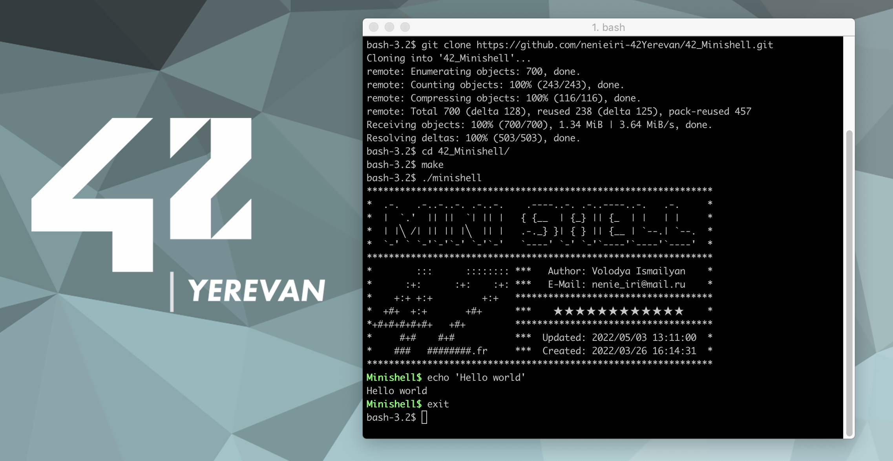

# Minishell
_As beautiful as a shell_ 😇

__42 project__ about creating a simple shell. MiniShell will introduce you to the world of shells, which provide a convenient text interface to interact with your system. Shells might seem very easy to understand but have very specific and defined behaviour in almost every single case, most of which will need to be handled properly.

## Introduction
The existence of shells is linked to the very existence of IT. At the time, all developers agreed that communicating with a computer using aligned 1/0 switches was seriously irritating. It was only logical that they came up with the idea of creating a software to communicate with a computer using interactive lines of commands in a language somewhat close to the human language. Thanks to Minishell, you’ll be able to travel through time and come back to problems people faced when Windows didn’t exist.

## Prerequisites
The shell needs to do a bunch of stuff, so just make sure you don’t do the following stuff:

- Have very spaghetti code which makes adding stuff in the future very hard, as doing it properly will make it easier to do projects like 21sh and 42sh;
- Wildcard and priority support will take you another month at the least, if you want to do them, make sure you have the according amount of time to do them;
- Do not leak memory and leak file descriptors (also not in your child processes on command execution);
- The shell must not crash in any scenario, its a shell, the only possible interaction you have with your OS, dont let it crash as then you shall be doomed.

## About the project
The behavior of the minishell is heavily based on the bash behavior. For every point, take bash as a reference. It is implemented with the rules described below.

Implement the following ___builtins___:
- `echo` and the `-n` option
- `cd` only with an absolute or relative path
- `pwd` without any options
- `export` without any options
- `unset` without any options
- `env` without any options or arguments
- `exit` without any options

Implement the following ___functions___:
- Display a __prompt__ while waiting for a new order.
- Have a working __history__.
- Find and launch the correct executable (based on a PATH environment variable or using an absolute path).
- Handle `’` __(single quote)__ which should prevent the shell from interpreting the metacharacters in the quoted sequence.
- Handle `"` __(double quote)__ which should prevent the shell from interpreting the metacharacters in the quoted sequence except for $ (dollar sign).
- `’` and `"` must work as in bash, except multiline.
- Implement __redirections__:
    - `<` should redirect input.
    - `>` should redirect output.
    - `<<` should be given a delimiter, then read the input until a line containing the delimiter is seen. However, it doesn’t have to update the history!
    - `>>` should redirect output in append mode.
- Implement __pipes__ (| character). The output of each command in the pipeline is connected to the input of the next command via a pipe.
- Handle __environment variables__  ($ followed by a sequence of characters) which should expand to their values.
- Handle `$?` variable which should expand to the exit status of the most recently executed foreground pipeline.
- Handle `ctrl-C`, `ctrl-D` and `ctrl-\` signals which should have the same behavior as in bash:
    - `ctrl-C` displays a new prompt on a new line.
    - `ctrl-D` exits the shell.
    - `ctrl-\` does nothing.

## Installation
> ⚠️ **Warning**: Don't copy/paste code you don't understand: it's bad for you, and for the school.

If you don't have gcc or GNU make do this commands:
``` sh
sudo apt update
sudo apt install build-essential
```
The program work both on MacOS and on Linux. <br>
For Linux you need to do this additional command:
``` sh
sudo apt-get install lib32readline8 lib32readline-dev
```
The rest of the commands are the same for both MacOS and Linux (Ubuntu)
___
First of all for this project you need to install GNU readline library. For that do this commands:
```sh
wget ftp://ftp.gnu.org/gnu/readline/readline-8.1.tar.gz
```
(Or you can download readline-8.1.tar.gz from [__HERE__](https://ftp.gnu.org/gnu/readline/))
``` sh
tar xvfz readline-8.1.tar.gz
cd readline-8.1
./configure --prefix=/$HOME/readline
make
make install
cd ..
rm -rf readline-8.1 readline-8.1.tar.gz
```

Now, to use this project you need to clone this repository, by running the following command:
``` sh
git clone https://github.com/nenieiri-42Yerevan/42_Minishell.git
```
Then you should go to the cloned repo and run the make command:
``` sh
cd 42_Minishell
make
```
After that you will see the executable minishell. Lastly you should run the executable:
```sh
./minishell
```
You will be provided with a prompt and can use it as a shell.

## Test cases
### __cd__:
``` sh
cd
cd .
cd ..
cd /Users
cd /
cd '/'
cd //////
cd ./././
cd ../../..
cd '/////' >/dev/null
cd "$PWD/directory"
cd $PWD/directory
cd $OLDPWD/directory
cd "doesntexist"
cd ?
cd +
cd _
cd woof
cd bark bark
```
### __echo__:
``` sh
echo
echo echo
eCho 
eChO
eCHO
ECHO
echo $
echo "$"
echo '$'
echo rhobebou
echo stop barking
echo nenie_iri
echo 'nenie_iri'
echo "nenie_iri"
echo -n
echo -n nenie_iri
echo -nn nenie_iri
echo -n -n -n nenie_iri
echo "-n" nenie_iri
echo -n"-n" nenie_iri
echo "-nnnn" nenie_iri
echo "-n -n -n"-n nenie_iri
echo "-n -n" nenie_iri
echo "-n '-n'" nenie_iri
echo $USER
echo "$USER"
echo '$USER'
echo "'$USER'"
echo " '$USER' "
echo nenie_iri"$USER"
echo nenie_iri"'$USER'" ' $USER '
echo "nenie_iri"   "$USER"    "$USER"
echo '              $USER          '
echo               nenie_iri "$USER"            "$USER"nenie_iri
echo ''''''''''$USER''''''''''
echo """"""""$USER""""""""
echo $USER'$USER'text oui oui     oui  oui $USER oui      $USER ''
echo $USER '' $USER $USER '' $USER '' $USER -n $USER
echo ' \' ' \'
echo "$USER""$USER""$USER"
echo nenie"$USER"iri
echo '$USER' "$USER" "nenie \' iri"
echo $USER " "
echo "$USER""Users/$USER/file""'$USER'"'$USER'
echo "$USER$USER$USER"
echo '$USER'"$USER"'$USER'
echo '"$USER"''$USER'"""$USER"
echo " $USER  "'$PWD'
echo $USER=4
echo $?
echo $USER213
echo "$USER=12$USER"
echo $PWD
echo $PWD/file
echo "$PWD/file"
echo "nenie_iri" "nenie_iri$USER" ... "$USER"
echo test      tout
```
### __exit__ (try with __echo $?__):
``` sh
exit 0 0
exit 42 42
exit -42 -24
exit 42
exit 42 53 68
exit 259
exit -12030
exit --1239312
exit ++++1203020103
exit +0
exit ++++++0
exit -----0
exit wrong
exit a
exit 1
exit "1"
exit "+102"
exit "1230"
exit "+++1230"
exit "1"23
exit "2"32"32"
exit "'42'"
exit '42'"42"42
exit +'42'"42"42
exit -'42'"42"42
exit 9223372
exit -9223372
exit 9223372036854775807
exit 9223372036854775808
exit 9223372036854775807135813514351
exit -9223372036854775807135813514351
exit 9223372036854775807135813514351 1351351531
exit -4
exit -1
exit 0
exit --000
exit "something"
exit export
exit echo
exit cd ..
exit something somethingv2
exit 42 42 42 42 42
exit echo something
exit exit
```
### __export__:
``` sh
env | grep "_="
export | grep "SHLVL"
export | grep "OLDPWD"
export | grep "PWD"
export $?
export TEST
export TEST=
export TEST=123
export ___TEST=123
export ""=""
export ''=''
export "="="="
export '='='='
export TE-ST=100
export TEST-=100
export _TEST=100
export _TEST=100
export ==========
export 1TEST=
export TES=T=""
export TE+S=T=""
export TES.T=123
export TES+T=123
export TES}T=123
export TES_T=123
export TE*ST=123
export TES#T=123
export TES@T=123
export TES$?T=123
export =============123
export +++++++=123
export ________=123
export export
export echo
export pwd
export unset
export TES^T=123
export TEST+=100
```
### __unset__:
``` sh
unset
unset doesntexist
unset PWD
unset PWD
unset OLDPWD
unset PATH
unset PATH
unset PATH
unset TES.T
unset TES+T
unset TES=T
unset TES}T
unset TES-T
unset _TEST
unset TES_T
unset TEST_
unset TE*ST
unset TES#T
unset TES@T
unset TES$?T
unset ============
unset +++++++
unset ________
unset export
unset echo
unset unset
unset TES^T
```
### __errors__ (try with __echo $?__):
``` sh
test
echo > <
<
hello world
cat wouaf wouaf
>
> > > >
>> >> >> >>
<<
EechoE
.echo.
>echo>
<echo<
>>echo>>
rm -f something
cat something
your minishell is perfect
cat < ls
cat < ls > ls
```
### __pipes__:
``` sh
env | grep "SHLVL"
echo oui | cat -e
echo oui | echo non | echo something | grep oui
echo oui | echo non | echo something | grep non
echo oui | echo non | echo something | grep something
cd .. | echo "something"
cd .. | pwd
ifconfig | grep ":"
ifconfig | grep nothing
whoami | grep $USER
cat Makefile | grep "FLAGS"
cat Makefile | cat -e | cat -e
cat Makefile | grep "FLAGS" | grep "FLAGS" | cat -e
export TEST=123 | cat -e | cat -e
unset TEST | cat -e
echo test | cat -e | cat -e | cat -e
whereis ls | cat -e | cat -e > test
echo test | cat -e | cat -e | cat -e | cat -e | cat -e | cat -e | cat -e | cat -e | cat -e | cat -e | cat -e | cat -e | cat -e | cat -e | cat -e | cat -e | cat -e | cat -e | cat -e | cat -e
ls -la | grep "."
cat tests/lorem.txt | grep arcu | cat -e
cat /dev/random | head -c 100 | wc -c
ls|ls|ls|ls|ls|ls|ls|ls|ls|ls|ls|ls|ls|ls|ls|ls|ls|ls|ls|ls|ls|ls|ls|ls|ls|ls|ls|ls|ls|ls|ls|ls|ls|ls|ls|ls|ls|ls|ls|ls|ls|ls|ls|ls|ls|ls|ls|ls|ls|ls|ls|ls|ls|ls|ls|ls|ls|ls|ls|ls|ls|ls|ls|ls|ls|ls|ls|ls|ls|ls|ls|ls|ls|ls|ls|ls|ls|ls|ls|ls|ls|ls|ls|ls|ls|ls|ls|ls|ls|ls|ls|ls|ls|ls|ls|ls|ls|ls|ls|ls|ls|ls|ls|ls|ls|ls|ls|ls|ls|ls|ls|ls|ls|ls|ls|ls|ls|ls|ls|ls|ls|ls|ls|ls|ls|ls|ls|ls|ls|ls|ls|ls|ls|ls|ls|ls|ls|ls|ls|ls|ls|ls|ls|ls|ls|ls|ls|ls|ls|ls|ls|ls|ls|ls|ls|ls|ls|ls|ls|ls|ls|ls|ls|ls|ls|ls|ls|ls|ls|ls|ls|ls|ls|ls|ls|ls|ls|ls|ls|ls|ls|ls|ls|ls|ls|ls|ls|ls|ls|ls|ls|ls|ls|ls|ls|ls|ls|ls|ls|ls|ls|ls|ls|ls|ls|ls|ls|ls|ls|ls|ls|ls|ls|ls|ls|ls|ls|ls|ls|ls|ls|ls|ls|ls|ls|ls|ls|ls|ls|ls|ls|ls|ls|ls|ls|ls|ls|ls|ls|ls|ls|ls|ls|ls|ls|ls|ls|ls|ls|ls|ls|ls|ls|ls|ls|ls|ls|ls|ls|ls|ls|ls|ls|ls|ls|ls|ls|ls|ls|ls|ls|ls|ls|ls|ls|ls|ls|ls|ls|ls|ls|ls|ls|ls|ls|ls|ls|ls|ls|ls|ls|ls|ls|ls|ls|ls|ls|ls|ls|ls|ls|ls|ls|ls|ls|ls|ls|ls|ls|ls|ls|ls|ls|ls|ls|ls|ls|ls|ls|ls|ls|ls|ls|ls|ls|ls|ls|ls|ls|ls|ls|ls|ls|ls|ls|ls|ls|ls|ls|ls|ls|ls|ls|ls|ls|ls|ls|ls|ls|ls|ls|ls|ls|ls|ls|ls|ls|ls|ls|ls|ls|ls|ls|ls|ls|ls|ls|ls|ls|ls|ls|ls|ls|ls|ls|ls|ls|ls|ls|ls|ls|ls|ls|ls|ls|ls|ls|ls|ls|ls|ls|ls|ls|ls|ls|ls|ls|ls|ls|ls|ls|ls|ls|ls|ls|ls|ls|ls|ls|ls|ls|ls|ls|ls|ls|ls|ls|ls|ls|ls|ls|ls|ls|ls|ls|ls|ls|ls|ls|ls|ls|ls|ls|ls|ls|ls|ls|ls|ls|ls|ls|ls|ls|ls|ls|ls|ls|ls|ls|ls|ls|ls|ls|ls|ls|ls|ls|ls|ls|ls|ls|ls|ls|ls|ls|ls|ls|ls|ls|ls|ls|ls|ls|ls|ls|ls|ls|ls|ls|ls|ls|ls|ls|ls|ls|ls|ls|ls|ls|ls|ls|ls|ls|ls|ls|ls|ls|ls|ls|ls|ls|ls|ls|ls|ls|ls|ls|ls|ls|ls|ls|ls|ls|ls|ls|ls|ls|ls|ls|ls|ls|ls|ls|ls|ls|ls|ls|ls|ls|ls|ls|ls|ls|ls|ls|ls|ls|ls|ls|ls|ls|ls|ls|ls|ls|ls|ls|ls|ls|ls|ls|ls|ls|ls|ls|ls|ls|ls|ls|ls|ls|ls|ls|ls|ls|ls|ls|ls|ls|ls|ls|ls|ls|ls|ls|ls|ls|ls|ls|ls|ls|ls|ls|ls|ls|ls|ls|ls|ls|ls|ls|ls|ls|ls|ls|ls|ls|ls|ls|ls|ls|ls|ls|ls|ls|ls|ls|ls|ls|ls|ls|ls|ls|ls|ls|ls|ls|ls|ls|ls|ls|ls|ls|ls|ls|ls|ls|ls|ls|ls|ls|ls|ls|ls|ls|ls|ls|ls|ls|ls|ls|ls|ls|ls|ls|ls|ls|ls|ls|ls|ls|ls|ls|ls|ls|ls|ls|ls|ls|ls|ls|ls|ls|ls|ls|ls|ls|ls|ls|ls|ls|ls|ls|ls|ls|ls|ls|ls|ls|ls|ls|ls|ls|ls|ls|ls|ls|ls|ls|ls|ls|ls|ls|ls|ls|ls|ls|ls|ls|ls|ls|ls|ls|ls|ls|ls|ls|ls|ls|ls|ls|ls|ls|ls|ls|ls|ls|ls|ls|ls|ls|ls|ls|ls|ls|ls|ls|ls|ls|ls|ls|ls|ls|ls|ls|ls|ls|ls|ls|ls|ls|ls|ls|ls|ls|ls|ls|ls|ls|ls|ls|ls|ls|ls|ls|ls|ls|ls|ls|ls|ls|ls|ls|ls|ls|ls|ls|ls|ls|ls|ls|ls|ls|ls|ls|ls|ls|ls|ls|ls|ls|ls|ls|ls|ls|ls|ls|ls|ls|ls|ls|ls|ls|ls|ls|ls|ls|ls|ls|ls|ls|ls|ls|ls|ls|ls|ls|ls|ls|ls|ls|ls|ls|ls|ls|ls|ls|ls|ls|ls|ls|ls|ls|ls|ls|ls|ls|ls|ls|ls|ls|ls|ls|ls|ls|ls|ls|ls|ls|ls|ls|ls|ls|ls|ls|ls|ls|ls|ls|ls|ls|ls|ls|ls|ls|ls|ls|ls|ls|ls|ls|ls|ls|ls|ls|ls|ls|ls|ls|ls|ls|ls|ls|ls|ls|ls|ls|ls|ls|ls|ls|ls|ls|ls|ls|ls|ls|ls|ls|ls|ls|ls|ls|ls|ls|ls|ls|ls|ls|ls|ls|ls|ls|ls|ls|ls|ls|ls|ls|ls|ls|ls|ls|ls|ls|ls|ls|ls|ls|ls|ls|ls|ls|ls|ls|ls|ls|ls|ls|ls|ls|ls|ls|ls|ls|ls|ls|ls|ls|ls|ls|ls|ls|ls|ls|ls|ls|ls|ls|ls|ls|ls|ls|ls|ls|ls|ls|ls|ls|ls|ls|ls|ls|ls|ls|ls|ls|ls|ls|ls|ls|ls|ls|ls|ls|ls|ls|ls|ls|ls|ls|ls|ls|ls|ls|ls|ls|ls|ls|ls|ls|ls|ls|ls|ls|ls|ls|ls|ls|ls|ls|ls|ls|ls|ls|ls|ls|ls|ls|ls|ls|ls|ls|ls|ls|ls|ls
env | sort | grep -v SHLVL | grep -v _=
export | sort | grep -v SHLVL | grep -v _= | grep -v OLDPWD
```
### 😈 Extra cases 😈:
``` sh
export IFS=_
export a=nenie_iri
touch $a
```

``` sh
mkdir -p a/b
cd a/b
rm -rf ../../a
cd ../
```

``` sh
export a="nenie'iri"
echo $a
```

``` sh
cat /dev/urandom | head -10
```
```Check leaks when interrupt from heredoc (CTRL-C)``` <br>
```Check SHLVL```
___
### Additional information
In my implementation I don't use any global variable and the project doesn't have any memory leak.
These are big plus.


